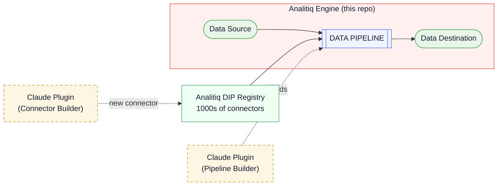
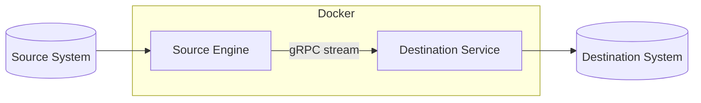

# Analitiq Data Sync Engine

An open-source, AI-managed data synchronization engine. Tell Claude what data you need to move — it builds the connectors, assembles the pipeline, and runs it. No coding required.

 - API -> Database
 - Database -> Database
 - API -> API
 - SFTP -> Database
 - and more

---

## How It All Fits Together



| Component | Repository | Role |
|---|---|---|
| **Pipeline Builder Plugin** | [ai-plugins-official](https://github.com/analitiq-ai/ai-plugins-official) | Claude Code plugin that assembles pipelines through conversation |
| **DIP Registry** | [analitiq-dip-registry](https://github.com/analitiq-dip-registry) | Pre-built Data Integration Protocols for common systems (Pipedrive, Wise, Xero, PostgreSQL, ...) |
| **Data Sync Engine** | [analitiq-core](https://github.com/analitiq-ai/analitiq-core) *(this repo)* | Runs the pipelines — extract, transform, load |

The DIP Registry already covers the most common systems. **Use the plugin** to pick a protocol and assemble a pipeline. **This engine** executes it. Or skip the setup and use **[Analitiq Cloud](https://analitiq-app.com)** for a fully managed experience.

> Don't see your system in the registry? A separate [Connector Builder plugin](https://github.com/analitiq-ai/ai-plugins-official) can create a new protocol from API docs — but for most use cases, a pre-built protocol is already available.

Learn more at [analitiq.ai](https://analitiq.ai).

---

## Why Analitiq Data Sync Engine?

- **Just describe what you need** — tell Claude in plain English where your data lives and where it should go. No code to write, no config files to learn.
- **Connect to almost anything** — APIs, databases, files, SFTP — if a connector exists in the registry, it just works. Need one that doesn't exist yet? Claude can build it for you.
- **Only sync what changed** — after the first run, the engine only picks up new and updated records, saving time and reducing load on your systems.
- **Never lose data** — if a sync is interrupted (network issue, server restart, anything), it picks up exactly where it left off. Failed records are saved for review, not silently dropped.
- **Data arrives correctly** — field types, formats, and mappings are handled automatically. Your dates stay dates, your numbers stay numbers, your text stays text.
- **No vendor lock-in** — runs on your own machine with Docker. No cloud account required, no surprise bills, no data leaving your network unless you want it to.
- **One image, zero complexity** — a single Docker image handles everything. No cluster to manage, no services to coordinate, no infrastructure to maintain.

---

## Everything Is Managed Through AI

The entire lifecycle — from connector creation to pipeline execution — is driven by conversation with Claude:

1. **Discover** — ask Claude what connectors are available in the DIP Registry
2. **Connect** — tell Claude your source and destination; it downloads connectors and creates connection configs
3. **Map** — Claude discovers schemas, presents available endpoints, and builds field mappings
4. **Run** — Claude generates the pipeline config and shows you how to execute it
5. **Extend** — need a connector that doesn't exist? The Connector Builder plugin creates one from API docs

No YAML to hand-edit. No DAGs to wire up. No SDKs to learn. Just tell Claude what you need.

---

## Getting Started

### Prerequisites
- [Docker](https://docs.docker.com/get-docker/)
- [Claude Code](https://claude.ai/code) with the **analitiq-pipeline-builder** plugin installed (see [AI Plugins](https://github.com/analitiq-ai/ai-plugins-official) for setup)

### 1. Create a pipeline

Open Claude Code in this project directory and say:

> *"I need to move data from Pipedrive to PostgreSQL"*

The **analitiq-pipeline-builder** plugin walks you through choosing connectors, entering credentials, and mapping fields. When it finishes, three directories appear:

```
connectors/    # connector definitions (downloaded from the DIP Registry)
connections/   # your connection configs and credentials
pipelines/     # pipeline and stream definitions
```

### 2. Run the pipeline

Find your pipeline ID in `pipelines/manifest.json`, then:

```bash
cd docker && \
  PIPELINE_ID=<your-pipeline-id> \
  docker compose run --rm source_engine
```

The engine reads from the source, transforms the data, and writes to the destination. State is checkpointed so interrupted runs resume where they left off.

---

## Configuration

The **analitiq-pipeline-builder** plugin generates all configuration files automatically. This section is for reference.

### Directory structure

```
connectors/{slug}/definition/
  connector.json              # Connector metadata and auth config
  manifest.json               # Lists available endpoints
  endpoints/{name}.json       # Endpoint schemas

connections/{alias}/
  connection.json             # Host, connector_slug, parameters
  .secrets/credentials.json   # Secret key-value pairs (never committed)
  endpoints/{name}.json       # Private endpoint schemas (e.g. DB tables)

pipelines/
  manifest.json               # Central index of all pipelines
  {pipeline_id}/
    pipeline.json             # Pipeline config (connections, runtime settings)
    streams/
      {stream_id}.json        # Stream config (source, destinations, mapping)
```

### Secrets

Connection configs use `${placeholder}` syntax for sensitive values. Actual secrets live in `connections/{alias}/.secrets/credentials.json` as flat key-value pairs:

```json
{
  "API_TOKEN": "your-token",
  "API_SECRET": "your-secret"
}
```

Placeholders are expanded at connection time (late-binding) — not at config load time. If any `${placeholder}` has no matching key, a `PlaceholderExpansionError` is raised and the connection is never established with raw placeholders.

---

## Architecture



- **Single Docker image** — engine and destination run from the same image, toggled by `RUN_MODE`
- **Engine** performs extract, transform, and streams batches to the destination over gRPC
- **Destination** receives batches and writes idempotently (database upsert, file manifest, API POST)
- **State** is checkpointed per stream so interrupted runs resume automatically

## Environment Variables

| Variable | Default | Description |
|---|---|---|
| `PIPELINE_ID` | *(required)* | Pipeline ID from `manifest.json` |
| `RUN_MODE` | `source` | `source` or `destination` |
| `ENV` | `local` | Environment: `local`, `dev`, `prod` |
| `LOG_LEVEL` | `INFO` | Logging level |
| `DESTINATION_GRPC_HOST` | | Destination service host (engine mode) |
| `DESTINATION_GRPC_PORT` | `50051` | gRPC port (engine mode) |
| `GRPC_PORT` | `50051` | gRPC listen port (destination mode) |
| `DESTINATION_INDEX` | `0` | Which destination from the pipeline config |

---

## Development

### Setup

```bash
poetry install
poetry shell
```

### Testing

```bash
poetry run pytest                           # all tests
poetry run pytest -m "unit"                 # unit tests only
poetry run pytest --cov=src --cov-report=html
```

### Code quality

```bash
poetry run black src/ && poetry run isort src/
poetry run mypy src/
poetry run flake8 src/
```

---

## License

Apache License 2.0